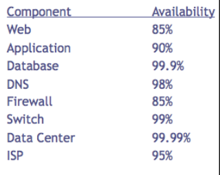
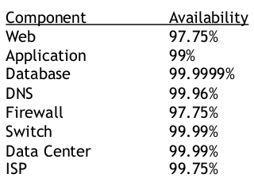

Ejercicio T2.1:
Calcular la disponibilidad del sistema si tenemos dos réplicas de cada elemento (en total 3 elementos en cada subsistema).

Datos sin redundancia:

ATotal = 85%*90%*99.9%*98%*85%*99%*99.99%*95% = 59.87%
   
Datos con 2 elementos de cada componente excepto el Data Center que sigue siendo solo uno:

ATotal = 97.75%*99%*99.9999%*99.96%*97.75%*99.99%*99.99%*99.75% =
94.3%

Mejora un 34.43%
   

> Mediante la siguiente formula obtendremos la redundancia de los 3 elementos:
>
> `As = Acn-1 + ( (1 – Acn-1 ) * Acn )` 
> 
> Aweb =  97,75% + ((1-97,75%) * 85%)  = **99,6625%**  
> AApp =  99%    + ((1-99%) * 90%)     = **99,9%**  
> ADB =  99,9999%    + ((1-99,9999%) * 99,9%)     = **99,9999999%**  
> ADNS =  99,96%    + ((1-99,96%) * 98%)     = **99,9992%**  
> AFireW =  97,75% + ((1-97,75%) * 85%)  = **99,6625%**  
> ASwitch=  99,99% + ((1-99,99%) * 99%)  = **99,9999%**  
> ADataCenter= **99.99%**  
> AISP= 99,75% + ((1-99,75%) * 95%)  = **99,9875**  
> 
> **ATotal** = 99,6625% x 99,9% x 99,9999999% x 99,9992% x 99,6625% x99,9999% x 99.99% x 99,9875 = **99,30289809%**

**Mejora un 39,43289809%**