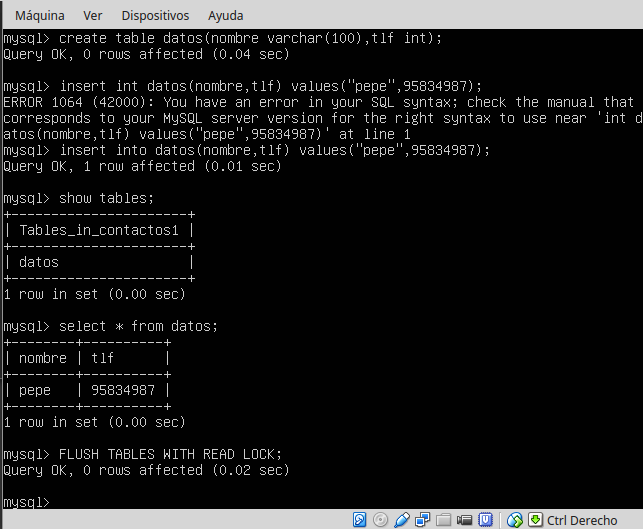

#Practica 5 Replicación de bases de datos MySQL

##Creamos la BD e insertarmos datos
####-Accedemos a MySQL
>     mysql -uroot -p

####-Creamos la base de datos con sus tablas e insertamos valores
>     create database contactos;
>     use contactos;
>     show tables;
>     create table datos(nombre varchar(100),tlf int);
>     insert into datos(nombre,tlf) values ("pepe",95834987);
>     show tables;
>     select * from datos;

##Replicamos la BD de MySQL con mysqldump
####-Evitamos que se acceda a la BD Principal

>        mysql -u root –p
>        FLUSH TABLES WITH READ LOCK;

####-Ahora usamos MySQLdump para guardar los datos
>        mysqldump contactos -u root -p > /root/contactos.sql

####-Desbloqueamos el acceso a la BD 
>        mysql -u root –p
>        UNLOCK TABLES;

####-Desde la maquina dos nos copiamos el archivo

>        scp root@192.168.1.100:/root/contactos.sql /root/

####-Ya podemos importar la BD del archivo
>        mysql -u root –p
>        CREATE DATABASE ‘contactos’;
>        mysql -u root -p contactos < /root/contactos.sql

##Replicamos la BD mediante una configuración maestro-esclavo
####-Como root modificamos el archivo my.conf que esta en /etc/mysql/ del maestro

>        #bind-address 127.0.0.1
>        log_error = /var/log/mysql/error.log
>        server-id = 1
>        log_bin = /var/log/mysql/bin.log
>        /etc/init.d/mysql restart

####-Como root modificamos el archivo my.conf que esta en /etc/mysql/ del esclavo
>        #bind-address 127.0.0.1
>        log_error = /var/log/mysql/error.log
>        server-id = 2
>        log_bin = /var/log/mysql/bin.log
>        /etc/init.d/mysql restart

####-En el maestro crearemos el usuario esclavo en mysql y le damos permisos  de replicacion y acceso
>        CREATE USER esclavo IDENTIFIED BY 'esclavo';
>        GRANT REPLICATION SLAVE ON *.* TO 'esclavo'@'%'IDENTIFIED BY 'esclavo';
>        FLUSH PRIVILEGES;
>        FLUSH TABLES;
>        FLUSH TABLES WITH READ LOCK;
>         SHOW MASTER STATUS; Para obtener los datos de la BD a replicar

####-En el esclavo le damos los datos a mysql del master

>        CHANGE MASTER TO MASTER_HOST='192.168.31.200',
>        MASTER_USER='esclavo', MASTER_PASSWORD='esclavo',
>        MASTER_LOG_FILE='bin.000005', MASTER_LOG_POS=1649,
>        MASTER_PORT=3306;
>        START SLAVE;

####-En el Maestro volvemos a activar las tablas.

>        UNLOCK TABLES;

####-Y vemos si todo funciona bien en el esclavo
>         SHOW SLAVE STATUS\G 
>        Como vemos todo ha ido correctamente

##Ejemplos de como se actualiza el esclavo cuando se modifica el maestro.

